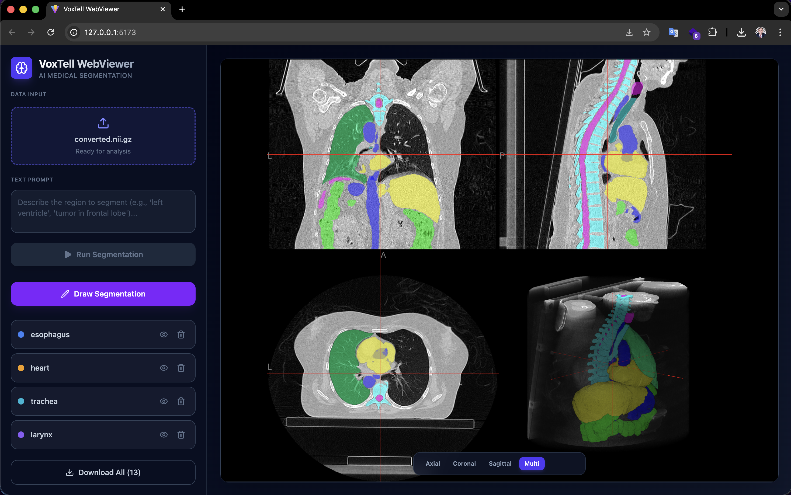

# VoxTell Web Interface

<div align="center">

[](https://arxiv.org/abs/2511.11450)
[](https://github.com/MIC-DKFZ/VoxTell)
[](LICENSE)

[](https://ko-fi.com/D1D21TYMMD)

**Free-text promptable 3D medical image segmentation with optimizations for consumer hardware**



</div>

---

## About

This project provides a **web-based interface** for [VoxTell](https://github.com/MIC-DKFZ/VoxTell), a state-of-the-art 3D vision-language model for medical image segmentation. VoxTell enables **natural language-driven anatomical segmentation** across CT, PET, and MRI modalities—simply describe what you want to segment in plain English.

### What is VoxTell?

VoxTell is a deep learning model that combines **3D image understanding** with **natural language processing** to segment anatomical structures from text prompts. Instead of traditional segmentation tools that require manual annotation or predefined labels, VoxTell accepts prompts like:

- **Single organs**: `"liver"`, `"brain"`, `"left kidney"`
- **Substructures**: `"right lung upper lobe"`, `"L5 vertebra"`
- **Complex queries**: `"prostate tumor"`, `"pancreatic head"`

The model was trained on **158 public datasets** with over **62,000 volumetric images**, covering brain, thorax, abdomen, pelvis, musculoskeletal structures, and pathological findings.

---

## Key Features

### 🔹 Low-VRAM Optimizations

This implementation includes **critical optimizations** to run VoxTell on consumer GPUs with **limited VRAM** (e.g., RTX 3060 12GB, RTX 4060 Ti 16GB):

| Component | Optimization | VRAM Savings |
|-----------|-------------|--------------|
| **Text Encoder** | Load `Qwen3-Embedding-4B` in `float16` precision | ~15GB → ~7.5GB |
| **Memory Allocator** | `PYTORCH_CUDA_ALLOC_CONF="expandable_segments:True"` | Reduces GPU memory fragmentation |
| **Sliding Window** | `perform_everything_on_device = False` | Offloads CPU-compatible ops to reduce peak VRAM |

> [!IMPORTANT]
> **Hardware Requirements**
> - **Minimum**: 12GB VRAM (tested on RTX 3080 12GB version)
> - **Recommended**: 16GB+ VRAM for larger volumes
> - **CPU**: Multi-core recommended for sliding window fallback

### 🔹 Interactive 3D Viewer

- **Multi-volume support**: Accumulate and compare multiple segmentations
- **Real-time 3D rendering**: Powered by [NiiVue](https://github.com/niivue/niivue)
- **Interactive overlay controls**: Toggle visibility and adjust opacity
- **Manual drawing**: Create and refine segmentation masks with an integrated drawing tool
- **Export segmentation masks**: Download individual or multiple segmentation masks as NIfTI (`.nii.gz`) or RTStruct files

### 🔹 Production-Ready Architecture

- **FastAPI backend**: Async inference server with CORS support
- **React + TypeScript frontend**: Modern, responsive UI built with Vite
- **Multi-format support**: Direct `.nii`, `.nii.gz`, and DICOM upload/processing

---

## Installation

### Prerequisites

- **Python**: 3.10 or higher
- **Node.js**: 20.x or higher (required for frontend — see [Troubleshooting](#troubleshooting) if you run into errors)
- **CUDA**: 11.8+ (for GPU acceleration)
- **Conda** (recommended for environment management)

> [!NOTE]
> **Two-terminal setup**: This application requires **two processes running simultaneously** — a backend server and a frontend dev server — each in its own terminal. You interact with the application through the **frontend** URL (`http://localhost:5173`), not the backend port.

### 1. Clone the Repository

```bash
git clone https://github.com/gomesgustavoo/voxtell-web-plugin.git
cd voxtell-web-plugin
```

### 2. Backend Setup

Create and activate a Conda environment:

```bash
conda create -n voxtell python=3.12
conda activate voxtell
```

Install PyTorch (adjust CUDA version as needed):

> [!WARNING]
> **PyTorch 2.9.0 Compatibility Issue**  
> There is a known OOM bug in PyTorch 2.9.0 affecting 3D convolutions. **Use PyTorch 2.8.0 or earlier** until resolved ([PyTorch Issue #166122](https://github.com/pytorch/pytorch/issues/166122)).

```bash
pip install torch==2.8.0 torchvision==0.23.0 --index-url https://download.pytorch.org/whl/cu126
```

Install VoxTell dependencies:

```bash
pip install -e .
```

Download the VoxTell model (see [`download_model.py`](download_model.py)):

```bash
# huggingface_hub is required
python download_model.py
```

### 3. Frontend Setup

Navigate to the frontend directory and install dependencies:

```bash
cd frontend
npm install
```

---

## Quick Start

You need **two terminal windows** open at the same time — one for the backend and one for the frontend.

### Terminal 1 — Backend Server

From the project root with the `voxtell` environment activated:

```bash
conda activate voxtell
python backend/server.py
```

The server will start on `http://0.0.0.0:8000`. **Keep this terminal running.**

### Terminal 2 — Frontend Application

Open a **new terminal window**, then:

```bash
cd frontend
npm run dev
```

The dev server will start on `http://localhost:5173`. **Keep this terminal running too.**

### Open the Application

Once both terminals are running, open your browser and go to:

**`http://localhost:5173`**

> [!IMPORTANT]
> You access the application through the **frontend** address (`http://localhost:5173`), not the backend port (`8000`). The frontend communicates with the backend automatically.

---

## Usage

1. **Upload a Scan**: Click the file input to select a `.nii`, `.nii.gz` file or a DICOM series
2. **Enter a text prompt**: Describe the anatomical structure (e.g., `"liver"`, `"prostate tumor"`, `"left kidney"`)
3. **Run segmentation**: Click the button and wait for inference to complete
4. **View results**: The 3D viewer displays your scan with the segmentation overlay (red, 50% opacity)
5. **Accumulate masks**: Multiple segmentations are preserved—use the "Segmentations" tab to manage visibility
6. **Download results**: Export segmentations as `.nii.gz` or RTStruct files for further analysis

### Additional Tools

- **Manual Drawing**: Optional drawing mode (pencil icon) for manual refinement or custom annotations
- **Batch Download**: Download all segmentation masks at once using the "Download All" button

### Example Prompts

| Prompt | Target Structure |
|--------|------------------|
| `"lungs"` | Both lungs |
| `"right kidney"` | Right kidney only |
| `"prostate tumor"` | Clinical target volume |
| `"L4 vertebra"` | L4 vertebral body |
| `"thoracic aorta"` | Descending thoracic aorta |

> [!TIP]
> **Image Orientation**  
> VoxTell requires images in **RAS orientation** for correct left/right anatomical localization. If segmentations appear mirrored or incorrect (e.g., liver segments spleen instead), verify your NIfTI metadata.

---

## Technical Details

### Architecture Overview

```
┌─────────────────┐
│  React Frontend │  ← User uploads .nii.gz + text prompt
└────────┬────────┘
         │ HTTP POST /predict
         │
┌────────▼────────┐
│  FastAPI Server │  ← Receives file + prompt
└────────┬────────┘
         │
┌────────▼────────┐
│ VoxTell Model   │  ← 3D vision-language inference
│  - Image Encoder│     (optimized for low VRAM)
│  - Text Encoder │
│  - Fusion Decoder│
└────────┬────────┘
         │
         └─────────► Returns .nii.gz segmentation mask
```

### Key Files

| File | Description |
|------|-------------|
| [`backend/server.py`](backend/server.py) | FastAPI inference server with `/predict` endpoint |
| [`voxtell/inference/predictor.py`](voxtell/inference/predictor.py) | VoxTell inference engine with FP16 text encoder |
| [`frontend/src/App.tsx`](frontend/src/App.tsx) | Main React application with file upload and API logic |
| [`frontend/src/components/Viewer.tsx`](frontend/src/components/Viewer.tsx) | NiiVue-based 3D medical image viewer |

### VRAM Optimization Details

The following modifications were made to the original VoxTell implementation:

**1. Text Encoder Precision Reduction**  
[`voxtell/inference/predictor.py`](voxtell/inference/predictor.py)
```python
# Load Qwen3-Embedding-4B in float16 instead of float32
self.text_encoder = AutoModel.from_pretrained(
    "Qwen/Qwen3-Embedding-4B",
    torch_dtype=torch.float16  # ← Halves VRAM usage
)
```

**2. Memory Fragmentation Mitigation**  
[`backend/server.py`](backend/server.py)
```python
os.environ["PYTORCH_CUDA_ALLOC_CONF"] = "expandable_segments:True"
```

**3. Sliding Window CPU Offload**  
[`backend/server.py`](backend/server.py)
```python
predictor.perform_everything_on_device = False
# Allows nnUNet to use CPU for preprocessing/postprocessing
```

---

## Troubleshooting

### Node.js version errors when running the frontend

If you get errors when running `npm run dev` (e.g., syntax errors, unsupported features), your Node.js version is likely too old. This project requires **Node.js 20.x or higher**.

Check your current version:

```bash
node --version
```

If it's below v20, update Node.js using [nvm](https://github.com/nvm-sh/nvm) (Node Version Manager):

```bash
# Install nvm
curl -o- https://raw.githubusercontent.com/nvm-sh/nvm/v0.40.1/install.sh | bash
source ~/.bashrc

# Install and use the latest LTS version
nvm install --lts
nvm use --lts

# Verify (should be v20.x or higher)
node --version
```

Then re-run the frontend setup:

```bash
cd frontend
npm install
npm run dev
```

### Backend fails to load the model

- Make sure you ran `python download_model.py` first — the model files must exist under `models/voxtell_v1.1/`.
- Ensure you have at least **12GB of GPU VRAM** available. Close other GPU-intensive applications before starting the server.

### Segmentations appear mirrored or incorrect

VoxTell requires images in **RAS orientation** for correct left/right anatomical localization. If results seem flipped (e.g., liver appears on the wrong side), verify your NIfTI file metadata and orientation.

---

## 📄 License

This project inherits the **Apache 2.0 License** from the original [VoxTell repository](https://github.com/MIC-DKFZ/VoxTell). See [`LICENSE`](LICENSE) for details.

---

## Acknowledgments

This project builds upon [VoxTell](https://github.com/MIC-DKFZ/VoxTell) by the **Division of Medical Image Computing (MIC), German Cancer Research Center (DKFZ)**:

> **Rokuss et al.** (2025). *VoxTell: Free-Text Promptable Universal 3D Medical Image Segmentation*. arXiv:2511.11450.

```bibtex
@misc{rokuss2025voxtell,
  title={VoxTell: Free-Text Promptable Universal 3D Medical Image Segmentation}, 
  author={Maximilian Rokuss and Moritz Langenberg and Yannick Kirchhoff and Fabian Isensee and Benjamin Hamm and Constantin Ulrich and Sebastian Regnery and Lukas Bauer and Efthimios Katsigiannopulos and Tobias Norajitra and Klaus Maier-Hein},
  year={2025},
  eprint={2511.11450},
  archivePrefix={arXiv}
}
```

Special thanks to the authors for open-sourcing this amazing work.

---

## Contact

For questions about this web interface implementation, contact:                          
📧 https://www.linkedin.com/in/gustavoogomesss/ 

For questions about the original VoxTell model, contact:  
📧 maximilian.rokuss@dkfz-heidelberg.de / moritz.langenberg@dkfz-heidelberg.de
